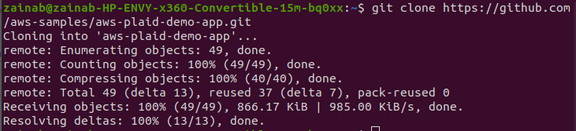
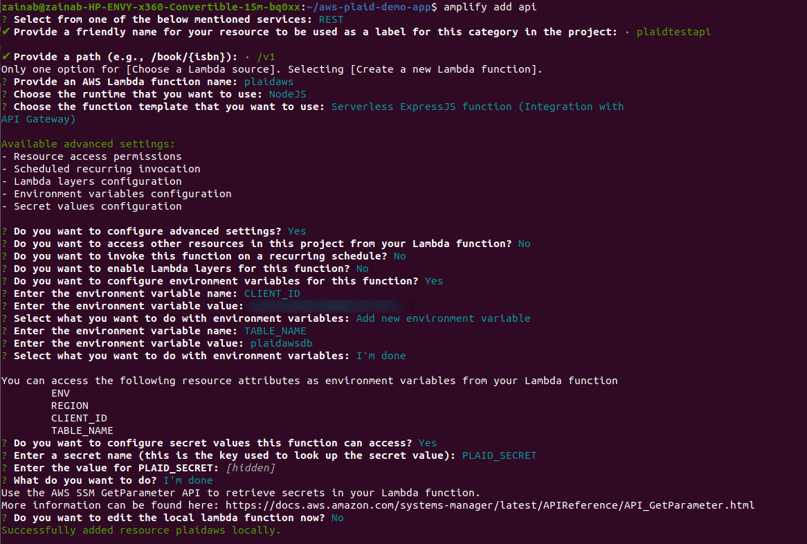

# **Build a Fintech App on AWS Using the Plaid API**

**Fintech**! **Fintech**!, this buzzword is everywhere but what does it even mean?

Financial Technology or **Fintech** as it is popularly known is used to describe technology that seeks to improve and automate the delivery and use of financial services. It includes tasks like depositing checks via phone, bypassing a bank branch to apply for credit, moving money online, managing your investments without the assistance of a person.

I am particularly excited about this project due to my background in finance and accounting. 

    

## **Benefits of Fintech Apps** 
**Greater Convenience** -  It provides convenience of transaction combined with the enhancement of efficiency. This leads to a better experience for customers.

**Safe and Secure** - Cybersecurity measures put on these apps are stringent and very effective

**Faster Approvals** - Digital lenders and financial providers can now go through multiple applications and approval processes faster. 

In this project, I will show you how to build and deploy a basic fintech app on AWS using *Plaid Link API*. This app allows users to sign up, login, select their bank from a list, connect to that bank and display the latest transactions. We will build a demo fintech app on AWS using the `AWS Amplify` framework and `Plaid Link`. 

## **Plaid**

**Plaid** is a fintech company that facilitates secure communication between financial services apps and user’s banks and credit providers. The software sits as an intermediary between your bank or credit accounts and other financial companies’ apps. 

### **How Plaid Link Works**
 

Plaid Link is the client-side component that your users will interact with in order to link their accounts to Plaid and allow you to access their accounts via the `Plaid API`.

Plaid Link will handle credential validation, multi-factor authentication, and error handling for each institution supported.

>

The diagram shows how `Link` is used to obtain a `public_token`, which can then be exchanged for an `access_token`, which is used to authenticate requests to the `Plaid API`.

## **This Project**

In this project, we will build a demo fintech app on AWS using the `AWS Amplify` framework and `Plaid Link`. 

First step is to create a sandbox account. 

To build an app using Plaid Link, you first need to go to Plaid.com, click on the **Get API Keys** button. 

>

Complete the necessary information and click **Create account**.

>

You have created a free sandbox account to start.

You can then log into your dashboard and find your sandbox `API` key under the menu for **Team Settings – Keys**.

All API calls are made through a Plaid client object. The message flow is as follows:

1. The app first creates a Plaid client object by passing in the Plaid API key and Plaid client ID. It then calls the client’s createLinkToken method to obtain a temporary link token.

2. When the user selects a bank, the app uses the link token to open a Plaid Link to the bank and obtain a temporary public token.

3. The app then calls the client object’s exchangePublicToken method to exchange the public token for a permanent access token and an item ID that represents the bank.

4. The app stores the access token in DynamoDB for subsequent requests pertaining to that item. For example, the app can pass the access token to the client object’s getTransactions method to obtain a list of transactions within a specific date range.

### **Building and Deploying the App**

#### **Prerequisites**

* You need to have created a sandbox account at Plaid.com and obtained your **API keys**

* You need to install **AWS Amplify** 

* You need to have created a default AWS configuration profile by running the aws config command. 

### **Install AWS Amplify**

**AWS Amplify** is a full suite package of tools and services designed to help developers easily create and launch apps. In this project, AWS Amplify helps build a serverless web app with a React frontend, user sign-up and sign-in using `Amazon Cognito`, an `Amazon API Gateway`- based `Rest API`, and an `Amazon DynamoDB` database for storage.

#### **Prerequisites for Amplify CLI**

* Install `Node.js` and `NPM` if not already installed

* Verify that you have `Node.js` and `NPM` by running node -v and npm -v. 

* You need to have an AWS account

>

Now run: 

    $ curl -sL https://aws-amplify.github.io/amplify-cli/install | bash && $SHELL

***Note: This may take some time to complete***.

>

Now that you have Amplify installed, you need to have it configured to your AWS account.

Start by running:

    $  amplify configure

>

You will be redirected to login into your AWS account. Once back in the terminal, click **Enter** to continue. 
You need to specify the region and then create a new **IAM user** for Amplify.

>

Once the new user is entered, you are redirected to the **Users** page under the **IAM Management** console in your browser to complete the setup.

On this page, you can edit the username *(I changed mine)*, leave everything has it is and click **Next: Permissions**. 

>

Make sure **AdministratorAccess-Amplify** is selected (this is usually selected by default) and then click **Next: Tags**. 

>

On the **Tags** page , click **Next: Review** and on the **Review** page, click on **Create user**.

>

Once the user is created, you are given an **access key ID** and a **secret access key**. It is important to download the file and keep it somewhere safe as you will need it later in the project. 

>

On your terminal, you will be asked to enter the access key ID and secret access key.

>

### **Building the App**

Clone the repo and run npm install:

    $ git clone https://github.com/aws-samples/aws-plaid-demo-app.git 

>

Navigate into the *aws-plaid-demo-app*:

    $ cd aws-plaid-demo-app

Now run:

    $ npm install

>

Initialize a new Amplify project. Hit **Enter** to accept all the defaults:

    $ amplify init

>

>

Next, add authentication:

    $ amplify add auth

**Note**: 

>Do you want to use the default authentication configuration?  Select **Default configuration**.
>
>How do you want users to be able to sign in? Select **username**.
>
>Do you want to configure advanced settings?  Select **No, I am done**.
>

>

Add the API:

    $ amplify add api

**Note**:

>Please select from one of the below mentioned services: **REST**.
>
>Provide a friendly name for your resource to be used as a label for this category in the project: **plaidtestapi**.
>
>Provide a path (e.g., /book/{isbn}): **/v1**.
>
>Choose a Lambda source: **Create a new Lambda function**.
>
>Provide an AWS Lambda function name: **plaidaws**.
>
>Choose the runtime that you want to use: **NodeJS**.
>
>Choose the function template that you want to use: **Serverless ExpressJS function (Integration with API Gateway)**
>
>Do you want to configure advanced settings? **Yes**
>
>Do you want to access other resources in this project from your Lambda function? **No**
>
>Do you want to invoke this function on a recurring schedule? **No**
>
>Do you want to enable Lambda layers for this function? **No**
>
>Do you want to configure environment variables for this function? **Yes**
>
>Enter the environment variable name: **CLIENT_ID**
>
>Enter the environment variable value: **[Enter your Plaid client ID]**
>
>Select what you want to do with environment variables: **Add new environment variable**
>
>Select the environment variable name: **TABLE_NAME**
>
>Enter the environment variable value: **plaidawsdb**
>
>Select what you want to do with environment variables: **I am done**
>
>Do you want to configure secret values this function can access? **Yes**
>
>Enter a secret name (this is the key used to look up the secret value): **PLAID_SECRET**
>
>Enter the value for PLAID_SECRET: **[Enter your Plaid sandbox API key - hidden]**
>
>What do you want to do? **I'm done**
>
>Do you want to edit the local lambda function now? **No**
>
>Restrict API access: **No**
>
>Do you want to add another path? **No**

To find your `Plaid client ID` as well as the `sandbox API key`, navigate to your **Team settings** in Plaid. 

>

Output for add api:

>

>

Copy the Lambda source file:

    $ cp lambda/plaidaws/app.js amplify/backend/function/plaidaws/src/app.js

Navigate to the file:

    $ cd amplify/backend/function/plaidaws/src 

Install dependencies:

    $ npm i aws-sdk moment plaid@8.5.4

>

Now push:

    $ amplify push

>

>

Add a database:

    $ amplify add storage 

**Note**:

>Please select from one of the below mentioned services: **NoSQL Database**
>
>Please provide a friendly name for your resource that will be used to label this category in the project: **plaidtestdb** 
>
>Please provide table name: **plaidawsdb**
>
>
>You can now add columns to the table. 
>
>What would you like to name this column: **id** 
>
>Please choose the data type: **string** 
>
>Would you like to add another column? **Yes** 
>
>What would you like to name this column: **token** 
>
>Please choose the data type: **string**
>
>Would you like to add another column? **No** 
>
>Please choose the partition key for the table: **id** 
>
>Do you want to add a sort key to your table? **No**
>
>Do you want to add global secondary indexes to your table? **No** 
>
>Do you want to add a Lambda Trigger for your Table? **No** 

>

Now, you need to update the Lambda function to add permissions for the database:

    $ amplify update function 

**Note**:

>Which setting do you want to update? **Resource access permissions**
>
>Select the categories you want this function to have access to: **Storage** 
>
>Do you want to edit the local lambda function now? **No**

>

### **Deploying the App** 

Add hosting for the app:

    $ amplify add hosting

>

Deploy the app:

    $ amplify publish 

>

>

### **Testing the App**

Go to the `URL` displayed by the amplify publish command.

>

Sign up as a new user. 

>

Select **Continue with plaid** and then select **Continue**.
>

>

After logging in, select a bank from the list displayed. 

>

If you are using the sandbox environment, use the credentials **user_good** and password **pass_good** to access the bank and display the transactions.

>

>

### **Conclusion**

***The project demonstrates how easy it is to use AWS Amplify to create a secure, scalable and completely serveless fintech app on AWS that allows users to signup, select their bank from the 10,000 bank options that Plaid Link is connected to and to obtain the transaction history for a particular account***. 

### **Clean Up**

To avoid charges after your project, you need to clean up and delete the resources used.

Navigate to your AWS account.

Search and select **AWS Amplify**. 

>

Click on the **awsplaiddemoapp** app that you created.

>

Select **Actions** and then **Delete app**.

>

***You have successfully completed this basic setup***. Feel free to recreate it and play around by adding additional features. 

    

